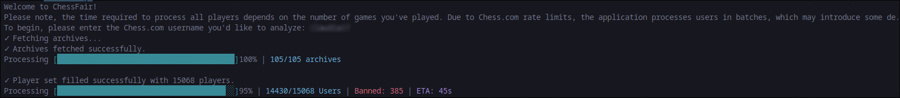

# What is ChessFair?

ChessFair is a CLI application that analyzes Chess.com game archives to identify players who have been banned for fair play violations. It processes large sets of game data while adhering to Chess.com rate limits, utilizing batch processing and displaying progress with detailed progress bars.

# Benchmarks

| Amount of Archives       | Amount of Players     | Time Taken (m:s:ms) |
|--------------------------|-----------------------|---------------------|
| 28                       | 90                    | 00:06.857           |
| 48                       | 259                   | 00:18.508           |
| 62                       | 1057                  | 01:24.189           |
| 17                       | 3209                  | 03:30.215           |
| 105                      | 3486                  | 04:46.964           |
| 105                      | 15068                 | 26:32.262           |

* These benchmarks were conducted with the following configuration:
    - Batch Size  = 30
    - Batch Delay = 1000

These modifiers can be increased, at the potential cost of rate limits, which would affect the accuracy.

# How do I use it?

Using NodeJS, simply run the main.js inside of the src folder. You will be asked to enter the Chess.com username you wish to analyze. Simply enter the username, press enter and wait for the results.

# Docker Setup

// Coming soon.

